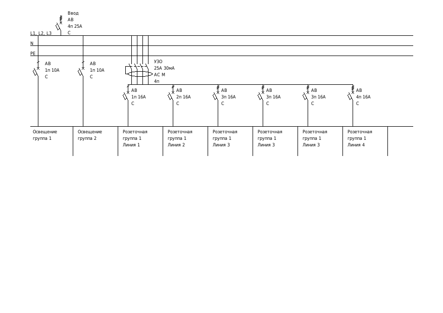
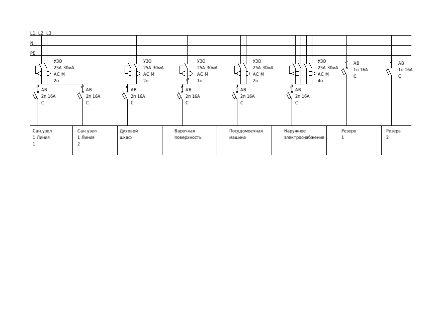

# Скрипт рисования схемы электрического щита
На входе получает данные следующего вида:
{
'header_id': 2269,
'spec': [
    {'group_id': 1, 'data': [{'line': 1, 'line_data': {'item_id': 1, 'module_name': 'АВ 4п 25А C', 'comment': 'Ввод'}}]},
    {'group_id': 2, 'data': [{'line': 1, 'line_data': {'item_id': 1, 'module_name': 'УЗИП 4п 20кА', 'comment': 'УЗИП'}}]},
    {'group_id': 3, 'data': [{'line': 1, 'line_data': {'item_id': 1, 'module_name': 'УЗО 25А 300мА AC M 4п', 'comment': 'Противопожарное УЗО'}}]},
    {'group_id': 4, 'data': [{'line': 1, 'line_data': {'item_id': 1, 'module_name': 'РН 3п 63А', 'comment': 'Реле напряжения'}}]},
    {'group_id': 5, 'data': [{'line': 1, 'line_data': {'item_id': 1, 'module_name': 'АВ 1п 10А C', 'comment': 'Освещение группа 1'}}]},
    {'group_id': 6, 'data': [{'line': 1, 'line_data': {'item_id': 1, 'module_name': 'АВ 1п 10А C', 'comment': 'Освещение группа 2'}}]},
    {'group_id': 7, 'data': [{'line': 1, 'line_data': {'item_id': 1, 'module_name': 'УЗО 25А 30мА AC M 4п', 'comment': 'Розеточная группа 1'}},
                             {'line': 2, 'line_data': [{'item_id': 2, 'module_name': 'АВ 1п 16А C', 'comment': 'Розеточная группа 1 Линия 1'},
                                                       {'item_id': 3, 'module_name': 'АВ 2п 16А C', 'comment': 'Розеточная группа 1 Линия 2'},
                                                       {'item_id': 4, 'module_name': 'АВ 3п 16А C', 'comment': 'Розеточная группа 1 Линия 3'},
{'item_id': 4, 'module_name': 'АВ 3п 16А C', 'comment': 'Розеточная группа 1 Линия 3'},
                                                       {'item_id': 4, 'module_name': 'АВ 3п 16А C', 'comment': 'Розеточная группа 1 Линия 3'},
                                                       {'item_id': 5, 'module_name': 'АВ 4п 16А C', 'comment': 'Розеточная группа 1 Линия 4'}]}]},
    {'group_id': 8, 'data': [{'line': 1, 'line_data': {'item_id': 1, 'module_name': 'УЗО 25А 30мА AC M 2п', 'comment': 'Сан.узел 1'}},
                             {'line': 2, 'line_data': [{'item_id': 2, 'module_name': 'АВ 2п 16А C', 'comment': 'Сан.узел 1 Линия 1'},
                                                       {'item_id': 3, 'module_name': 'АВ 2п 16А C', 'comment': 'Сан.узел 1 Линия 2'}]}]},
    {'group_id': 9, 'data': [{'line': 1, 'line_data': {'item_id': 1, 'module_name': 'УЗО 25А 30мА AC M 2п', 'comment': 'Духовой шкаф'}},
                             {'line': 2, 'line_data': [{'item_id': 2, 'module_name': 'АВ 2п 16А C', 'comment': 'Духовой шкаф'}]}]},
    {'group_id': 10, 'data': [{'line': 1, 'line_data': {'item_id': 1, 'module_name': 'УЗО 25А 30мА AC M 1п', 'comment': 'Варочная поверхность'}},
                              {'line': 2, 'line_data': [{'item_id': 2, 'module_name': 'АВ 2п 16А C', 'comment': 'Варочная поверхность'}]}]},
    {'group_id': 11, 'data': [{'line': 1, 'line_data': {'item_id': 1, 'module_name': 'УЗО 25А 30мА AC M 2п', 'comment': 'Посудомоечная машина'}},
                              {'line': 2, 'line_data': [{'item_id': 2, 'module_name': 'АВ 2п 16А C', 'comment': 'Посудомоечная машина'}]}]},
    {'group_id': 12, 'data': [{'line': 1, 'line_data': {'item_id': 1, 'module_name': 'УЗО 25А 30мА AC M 4п', 'comment': 'Наружное электроснабжение'}},
                              {'line': 2, 'line_data': [{'item_id': 2, 'module_name': 'АВ 2п 16А C', 'comment': 'Наружное электроснабжение'}]}]},
    {'group_id': 13, 'data': [{'line': 1, 'line_data': {'item_id': 1, 'module_name': 'АВ 1п 16А C', 'comment': 'Резерв 1'}}]},
    {'group_id': 14, 'data': [{'line': 1, 'line_data': {'item_id': 1, 'module_name': 'АВ 1п 16А C', 'comment': 'Резерв 2'}}]}
]
}

На выходе создает картинки в формате .jpg с постраничными изображениями схемы.

